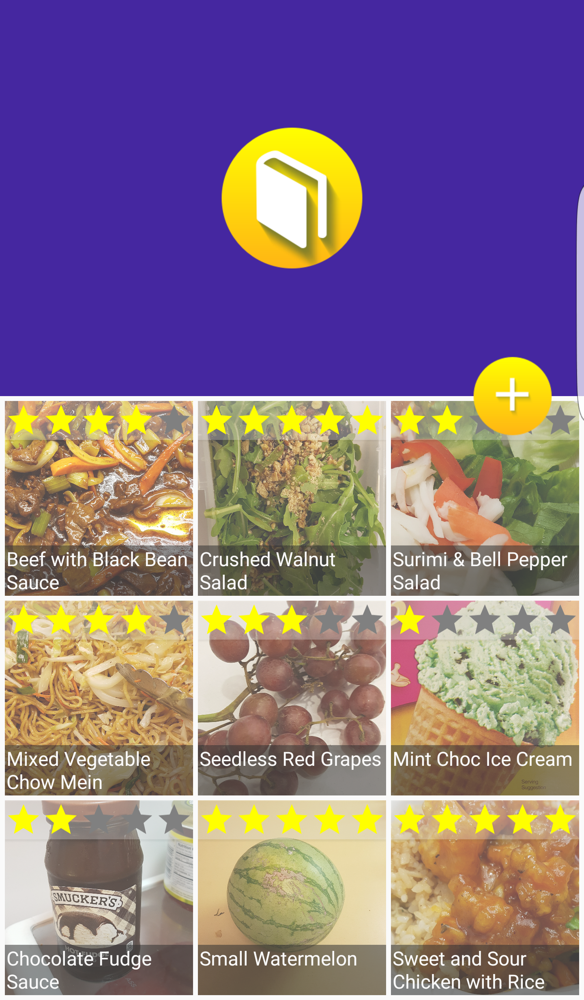
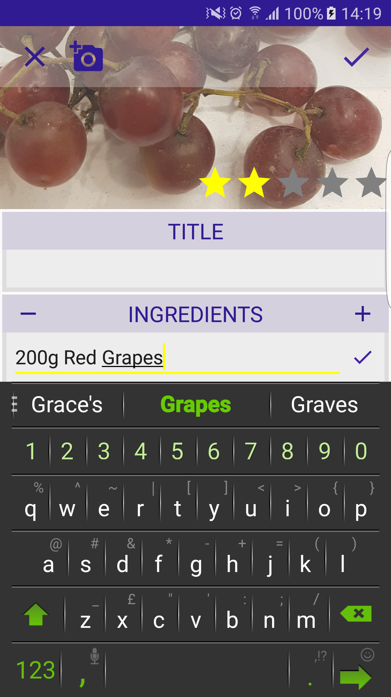
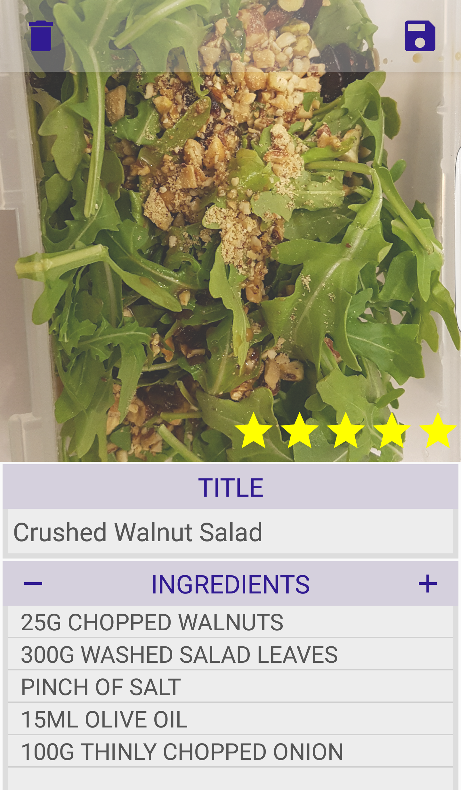

#ADI Churro - Project 01

##My Recipe Book

Add screenshots & description here. To see a short video demonstration of my paper prototype, [click here.] (https://www.youtube.com/watch?v=YfShw1BgMKY)

###Project Requirements
#######
For this project, I was tasked to create my very first Android app that runs on a real Android device! The main goal of the project was to gather knowledge in using **Android Activities, Intents, Layouts & ListViews** over the course of a week. The more specifc requirements were as follows:

- Implement a paper prototype for your app.
- Your app must contain ListViews and/or GridViews
- Your app must implement at least two Activities
- Data must be passed from one activity to another
- Users can add/edit/delete items in each list
- Display in both landscape and portrait orientations

###Summary
#######
My first experience of creating a fully functioning android application from concept to finished product was thrilling. The feeling of being able to look at something that I have created, that does what I want it to, and is easy on the eye is a great one. I've had highs and lows over the short space of time, but I can already say that pushing to develop great applications is an addiction for me.

###Step 1: Planning
#######
The first step was to formulate an idea. For me, a big part of the decision making process for each project is to push myself and learn new skills for my future career. With that in mind, I set my goal in this task to successfully utilize the user's local camera application to show images within my app.

The idea I settled on was to create a **virtual recipe book**. Users will be able to document their favourite home made meals by taking photos of them, adding a list of ingredients and rating the meal for future reference!

###Step 2: Paper Prototype
#######
As someone with a passion for all things crafty, I was excited that paper prototyping was to be part of the process. I found this very useful, easily being able to make changes and change usability without having to modify big blocks of code! A short video demonstration of my paper prototype can be found [here.] (https://www.youtube.com/watch?v=YfShw1BgMKY)

###Step 3: Creating Activity Layouts
#######
As a new android developer, I felt that this would be the best place to begin. I stand by that decision, however I have learnt that the fine tuning is something that I should leave until core functionality is in place. I ended up undoing a large amount of work that I had done early in the week, and my resulting xml layout files are a little untidy.

###Step 4: Creating Intents Between Activities & Adding Functionality With Java
#######
This is where the magic happens. The most important tool that I will have in my pocket as an android developer. I feel with the project that I jumped into the Java too quickly - only creating a basic class structure and brief pseudocode before going for it, all guns blazing!

This resulted in large areas of repition, and some redundant code. Overall, I am delighted with the functionality that I added and how it appears to a user; however as a developer, I made my life a lot harder than it needed to be!

###Step 5: Fine-Tuning And Bug-Fixing
#######
For me, the final stage in the process was to test the app as an *impartial* user, and add in any functionality that I would expect. This was enjoyable, and I feel it led to an aesthetically pleasing app!
