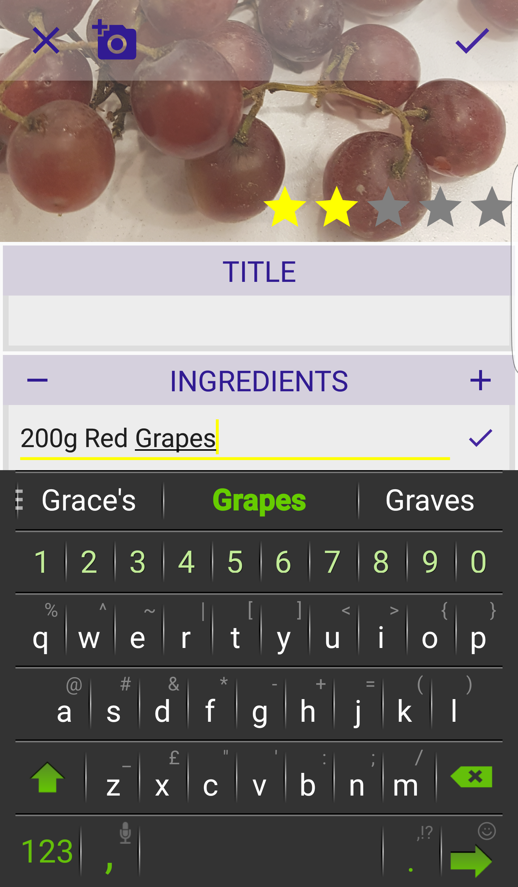

#My Recipe Book

##Screenshots

##Summary

'My Recipe Book' is a virtual recipe book application. Users can document their favorite homemade meals, along with the required ingredients and a rating for future reference. The app users the native camera and saves references to file paths to display the image across screens. This was a week-long project undertaken as part of the Android Immersive program at General Assembly in Seattle and was my first fully formed application. I was very ambitious in my goals for this project, and managed to produce a very usable application.

The screenshots above show three different scenarios within the application.
 - The first is the main screen of the application, where users can see their created recipes in a grid view. 
 - The second is the screen for adding a new recipe, where user can add a photo of their recipe and add in the ingredients required.
 - The third shows the screen when editing a recipe. From here users can customize the recipe over time or delete some recipes which may no longer interest them.

To see a short video demonstration of my paper prototype for this application, [click here.] (https://www.youtube.com/watch?v=YfShw1BgMKY)

##Author

[Matthew Duffin] (https://duffin22.github.io/) - Android Developer
